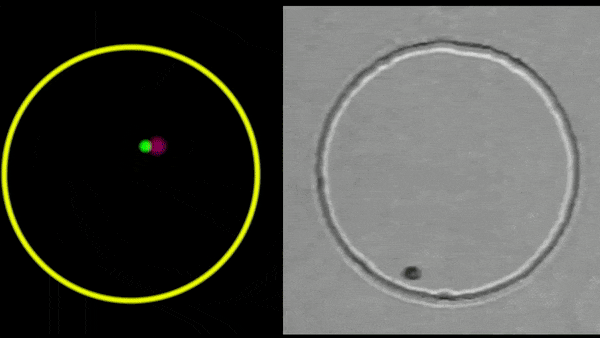

# Modelling microbial motion: the case of Chlamydomonas reinhardtii



##
This is a numerical implementation of a mathematical model that represents the motion of the unicellular eukaryotic organism Chlamydomonas Reinhardtii. All the parameters of the model and the simulation can be found (and modified) in the folder "parameters". Slides briefly showing the model and the results of the simulation can be found [here](https://lucapizzagalli.github.io/Projects/Thesis/thesis_slides.html)


## How to make it work
Tested on linux ubuntu.

### Install dependencies
The first step is to obtain the necessary libraries:
 This is the official location of the Kaldi project. 
#### GNU Scientific Library
- obtain [GNU scientific library](www.gnu.org/software/gsl/doc/html/index.html)for generating random numbers:
  * on ubuntu you can maybe try: ```apt-get install libgsl0ldbl``` or ```apt-get install libgsl0-dev``` or ```apt-get install gsl-bin libgsl0-dev```
  * you can also download the source code from <ftp://ftp.gnu.org/gnu/gsl/> ("gsl-latest.tar.gz") and compile it following the instruction in "INSTALL"

#### SDL2
- obtain [SDL2](www.libsdl.org) libraries for the visualization:
  * graphics: ```apt-get install libsdl2-dev``` (maybe only ```apt-get install libsdl2-2```)
  * fonts: ```apt-get install libsdl2-image-dev``` and ```apt-get install libsdl-ttf2-dev``` (maybe only ```apt-get install libsdl2-image``` and ```apt-get install libsdl-ttf2```)

#### meson
- [Meson](http://mesonbuild.com) for building the project:
```pip3 install meson```

### Compile and run
Build the project:
- ```meson build```

and run with:
- ```./initializer.py```

### Profiling
- install [Valgrind](http://valgrind.org/): ```apt-get install valgrind```
- install [kcachegrind](http://kcachegrind.sourceforge.net): ```apt-get install kcachegrind```
- memory leaks check: ```valgrind --leak-check=yes build/swimmers-brownian-simulation <input file>```
- profiling:
⋅⋅* ```valgrind --tool=callgrind build/swimmers-brownian-simulation <input file>```
⋅⋅* ```callgrind_annotate callgrind.out.<pid>```
